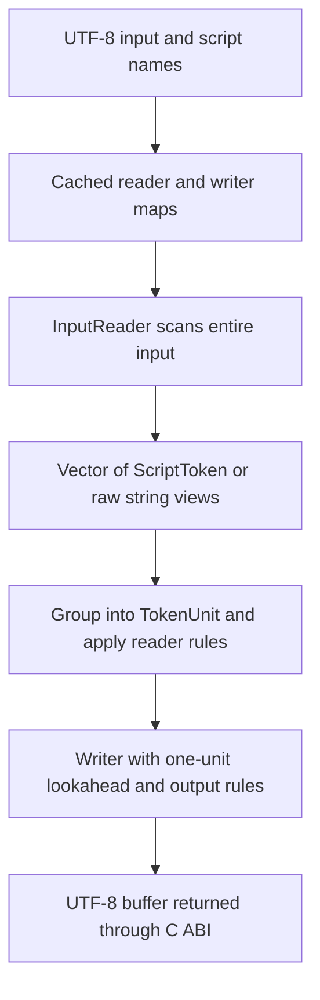
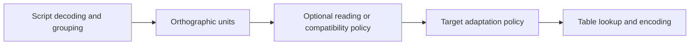
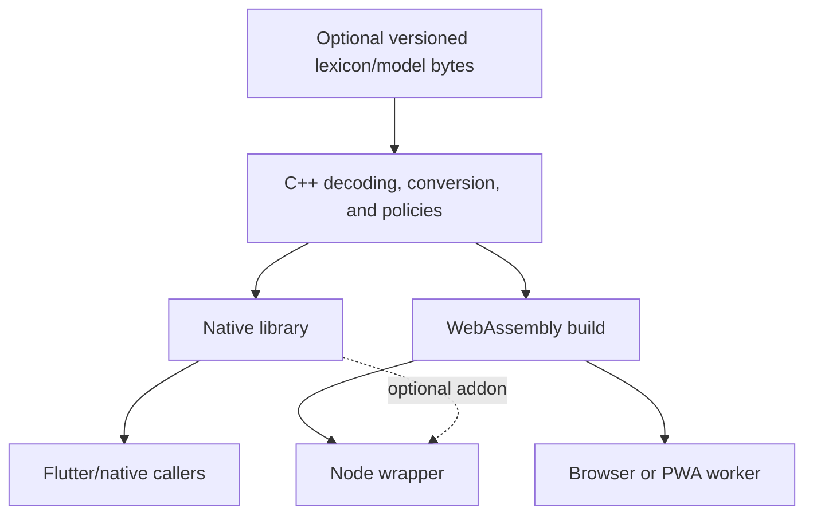

# Exploring pronunciation and restoration in IndiTrans

Research snapshot: 2026-09-26, branch `dev`, commit `d8b7140`.

This is an architectural and technical exploration, not an implementation plan or an accepted design. It starts from the current source and the linguistic problem. Existing GitHub issues, implementation plans, and the abandoned NAT roadmap were not used as requirements. No engine or package behavior was changed.

The supplied brief ends mid-sentence after “Explore whether Node should use Wasm, a native addon, or offer both, but do not”. This document covers the visible brief, including that comparison, without inventing the missing qualification.

## Reading guide

- [Main findings](#main-findings)
- [Current engine and historical lessons](#1-current-engine-and-historical-lessons)
- [What output is being requested?](#2-what-output-is-being-requested)
- [Tamil, Hindi, and Bengali](#3-linguistic-boundaries)
- [Architectural alternatives](#4-architectural-alternatives)
- [Candidates, ambiguity, and context](#5-candidates-ambiguity-and-context)
- [Representation and rule mechanisms](#6-representation-and-rule-mechanisms)
- [Lexicons](#7-lexicons)
- [Optional statistical and neural components](#8-optional-statistical-and-neural-components)
- [Inference technology](#9-inference-technology)
- [Performance](#10-performance-and-resource-costs)
- [Deployment](#11-deployment-and-api-boundaries)
- [Evidence needed to choose](#12-evidence-needed-to-choose)
- [Promising directions and open decisions](#13-promising-directions-and-open-decisions)
- [Inspection and verification record](#14-inspection-and-verification-record)

## Main findings

1. **Preserve the C++ engine and its indexed token tables.** They already provide a compact cross-script mechanism. Replacing them with a universal phonological system would impose migration costs before demonstrating a benefit.
2. **Separate the requested interpretation from the output script.** A Tamilized name, its Sanskrit antecedent, and a transcription of its actual pronunciation can all be legitimate outputs. Language detection cannot choose the user's intention.
3. **The current reader is already interpretive.** Tamil allophone choices and consonant deletion happen before writing. A resolver attached only after this stage would see transformed tokens with no record of whether a distinction was explicit or inferred.
4. **Sparse ambiguity is promising, but sparsity and candidate completeness are hypotheses.** Tamil Sanskrit restoration can affect several positions and word boundaries. Hindi/Bengali inherent-vowel decisions may be frequent. The generator can become the accuracy bottleneck.
5. **Compare at least three serious directions:** rules plus a lexicon; constrained local prediction with limited joint decoding; and candidates ranked with word/phrase evidence. A finite-state formulation is also credible where morphology and interacting alternatives justify it.
6. **A useful first smart component could have no neural network.** Lexical variants, a linear classifier, a small tree ensemble, or n-gram scoring deserve comparison with an MLP or small recurrent model. There is no evidence yet that IndiTrans needs a transformer or a general inference runtime.
7. **Do not equate repeatability with linguistic certainty.** A fixed rule, lexicon entry, or quantized model can produce reproducible but wrong results. Preserve explicit input, expose uncertainty where useful, and allow abstention.

All architecture preferences below are engineering judgments. Resource estimates are calculations under stated assumptions, not measured performance or claims of linguistic coverage.

## 1. Current engine and historical lessons

### 1.1 Actual data flow

The implementation is concentrated in [inditrans.cpp](../native/src/inditrans.cpp). Its supporting structures live in [type_defs.h](../native/src/type_defs.h), [script_constants.h](../native/src/script_constants.h), [utilities.h](../native/src/utilities.h), [trie.h](../native/src/trie.h), and [utf.h](../native/src/utf.h).



The final loop is incremental over an already materialized vector. It is **not a streaming input API**: the reader constructor scans and stores the whole input first. `tokenUnits.reserve(input.size())` reserves one variant slot per input byte, which is a conservative upper bound with potentially substantial unused capacity.

`ScriptData::getScripts()` lazily parses a compiled, NUL-delimited script blob into maps and vectors. String views point into the blob, avoiding copies of the strings; the containers still allocate. Reader maps construct heap-based tries; writer maps construct indexed vectors. Cached maps amortize this work across calls. Reader/writer objects, token storage, and the output builder also allocate.

Thus the statement in [ARCHITECTURE.md](../ARCHITECTURE.md) that only the output buffer allocates is contradicted by the code. This exploration uses source evidence for cost estimates.

### 1.2 What the representation means

| Representation | Current content | Architectural consequence |
|---|---|---|
| `Token` | One-byte category and one-byte index | Small, easy to copy, direct table lookup |
| `ScriptToken` | `Token`, broad `ScriptType`, extra-expansion index | Knows Indic/Tamil/Latin family, not full language or even exact Indic source script |
| `TokenUnit` | Lead token, one vowel mark, one other diacritic, one accent | Useful consonant/vowel grouping; not a full syllable, phoneme string, or arbitrary combining-mark sequence |
| Raw string view | Unrecognized/preserved input span | Retains bytes while source memory remains alive; no semantic boundary classification |
| Script tables | Parallel arrays plus equivalents and aliases | Reuses the same index across scripts; many-to-one mappings and approximations are possible |

The consonant ordering contains the five Sanskrit stop/nasal series, other Indic consonants, and explicit Tamil entries for ள, ழ, ற, ன. It already distinguishes ன/ந/ண, ர/ற, and ல/ள/ழ at the orthographic level. They do not need to be rediscovered statistically when written distinctly.

An absent vowel mark on an Indic consonant encodes the inherent-vowel convention; a virama is index zero in the vowel-mark category. That convention is useful for transliteration but does not encode whether a particular inherent vowel is pronounced. Nor does the common index prove identical surface pronunciation across languages. The `ipa` script is another table of output strings, not a language-conditioned pronunciation engine.

`ScriptToken::extra` expands an input equivalent into multiple tokens. It is not a set of competing readings. Its byte-sized index also makes it unsuitable as a general lexicon record identifier. The `languages` field is parsed into `ScriptInfo` but is not consulted by the transliteration pipeline. `hindi` and `sanskrit` are aliases of Devanagari in [tool/script_data.json](../tool/script_data.json), not distinct pronunciation policies.

### 1.3 Where interpretation already enters

- `readTamilTokenUnit()` groups marks, reads superscript/subscript distinctions, tracks word/prefix state, and changes consonant indices according to preceding context. It can discard a primary consonant carrying virama at a word end. That last operation removes a consonant unit, not merely an inherent vowel.
- `TamilSuperscripted` short-circuits the contextual portion of that reader. Its meaning therefore affects interpretation as well as rendering.
- `writeTamilTokenUnit()` applies a positional ந→ன substitution, traditional-letter substitutions, superscript placement, and anuswara handling.
- `TamilPrefixLookup` uses six literal prefixes and is used by both reader and writer. This is a useful bounded mechanism, not a morphological analyzer.
- Generic `getNext()` contains Gurmukhi adhak handling. `inferAnuswara()` lives in the writer and uses the next token and target family.
- Raw string spans reset `wordStart`. Tags, punctuation, foreign text, and protected regions are not distinguished as linguistic boundary types.

These mechanisms explain why adding one generic “language rule” pass is insufficient. Some current operations decode explicit information; some choose pronunciation; others adapt spelling to the target. A future interpretation layer would need to distinguish these responsibilities while preserving existing public behavior.

### 1.4 Tries and generated data

The live tokenizer uses `Char32Trie<ScriptToken>` in `utilities.h`: Unicode scalar keys, longest-match lookup, heap nodes, and `unordered_map` children. `StatefulTrie<TokenUnit, bool>` handles prefix state. Both are reusable for prototypes and small lookup sets.

[char_trie.h](../native/src/char_trie.h) contains an unused packed structure with 16-bit keys/offsets. It is not evidence of a working generated static-trie pipeline. Its token reconstruction argument order is suspicious, and packed layout, offset limits, endianness, and alignment would need validation before reuse. A lexicon with tens of thousands of entries should not inherit these limits accidentally.

[generate_headers.py](../tool/generate_headers.py) and [codegen_data.py](../tool/python/codegen_data.py) are the actual data-generation path. They serialize the editable JSON tables, generate script/option declarations, and add selected Latin equivalents. They provide a useful authoring/build pattern for optional linguistic data. They do not implement universal Unicode normalization or generate a pronunciation model.

The virtual `indic` reader combines non-Latin script maps. That supports mixed **scripts**, not mixed-language interpretation. It retains only the broad script family on tokens. Source-script identity must be retained separately if a later resolver needs to distinguish Bengali and Devanagari inside that input.

### 1.5 Tests and wrappers

The shared suite resolves through a symlink from [test-files/test-cases.json](../test-files/test-cases.json) to `flutter/example/assets/test-cases.json`. At this snapshot it contains 27 source cases and 47 listed targets, including five Tamil source cases. None has Hindi or Bengali as its source label. The native suite additionally consumes [sanscript-tests.json](../test-files/sanscript-tests.json): 23 cases, comprising seven conversion matrices, six round-trip cases, and ten direct cases. These case counts are not expanded assertion counts. The small trie and UTF suites check basic insertion/lookup and encoding examples; they do not establish normalization or linguistic completeness.

These are valuable compatibility fixtures: Tamil inference, prefixes, superscripts, compound vowels, accents, skip behavior, and other script cases. They do not establish pronunciation accuracy, ambiguity recall, dialect coverage, or performance on mixed devotional text. Node and Dart consume the shared fixture, but their harnesses do not reproduce all native matrix/round-trip logic. The native loader can silently do no work if the fixture cannot be opened or parsed; a passing process alone is therefore weak coverage evidence.

[Node's wrapper](../nodejs/src/index.ts) loads Emscripten JavaScript with `require`, waits conditionally for runtime initialization, then calls the JS bridge. [The build script](../tool/build_wasm.sh) uses `SINGLE_FILE=1`, `-Oz`, and memory growth for that distribution. The standalone Flutter Wasm artifact has a separate build path. [Dart](../flutter/lib/inditrans.dart) loads native/Wasm through `universal_ffi`.

Source inspection also reveals integration concerns to keep separate from linguistic design:

- Dart guards unsupported directions and returns input for same-script conversion; C++ returns failure for the latter. TypeScript forwards without equivalent guards. The agent guide's claim of identical enforcement is not borne out by this wrapper.
- `releaseBuffer()` uses `delete[]`, while `Utf8StringBuilder` grows with `realloc`; C++ overloads also transfer this storage through `unique_ptr<char>`. This is an allocator/deallocator mismatch in source.
- The Dart wrapper does not explicitly release the returned C++ buffer after copying. Arena cleanup covers its own input allocations, not demonstrably this returned allocation.
- Function-local static construction is protected by C++ initialization rules, but subsequent mutation of the reader/writer caches and shared prefix trie is not visibly synchronized.

These are source-level findings, not sanitizer-confirmed incidents. They matter for long-lived PWA sessions, parallel native callers, and any attempt to measure extra model cost. This research does not repair them.

### 1.6 Relevant history

File-following history and selected source diffs show continuity in the small-core approach:

| Commit | Evidence | Lesson for this exploration |
|---|---|---|
| `7de85a6` (2023-03-17) | Script-encoding refactor; commit records Wasm changing from 55,199 to 48,613 bytes alongside other changes | Data layout can materially affect this library's footprint; this is not an isolated benchmark of the encoding |
| `88f84a0` (2023-03-22) | Compound equivalents and Malayalam chillus added through token expansion | One source grapheme need not map to one canonical unit; source alignment needs ranges |
| `c605cc4` (2025-02-07) | Tamil superscript placement split around multipart vowel marks | Rendering details belong with script writers; phonological simplification must not break encoding |
| `a93dc52` (2026-02-08), file history | Custom skip delimiters | Protected spans are part of compatibility and must remain opaque to interpretation |

No existing issue or milestone was treated as an architectural commitment. The historical source demonstrates useful constraints, not a mandate to preserve abandoned NAT designs.

## 2. What output is being requested?

Three operations should be distinguishable even if one API eventually exposes them:

| Operation | Meaning | Example of a legitimate difference |
|---|---|---|
| Orthographic transliteration | Express the written distinctions in another script/scheme | Preserve an inherent-vowel position and distinct Tamil letters |
| Pronunciation transcription | Express a chosen language/register's reading | Suppress Hindi schwas, or represent a Tamil contextual consonant |
| Lexical restoration | Recover a possible antecedent or intended form lost in spelling | Restore Sanskrit aspiration or a consonant cluster not preserved in Tamil |

Restoration can change more than voicing. Assimilation can involve inserted vowels, changed clusters, endings, and lexicalized forms. Recovering an antecedent is not necessarily a correction to the regional word. A Sanskrit-derived Tamil word can be perfectly correct with Tamil pronunciation.

For example, राम can correspond to the conventional Sanskrit transliteration `rāma`, while a Hindi pronunciation has no final inherent vowel. The script alone does not select the intended reading. Likewise, recognizing a divine name inside Tamil does not establish whether the user wants a local devotional pronunciation or a Sanskrit form. These examples illustrate the output contract; they are not new expected-output fixtures.

The smallest useful explicit concepts appear to be:

- **Source script/scheme and target script/scheme:** already central to the library. A roman scheme is an encoding choice, not a language.
- **Requested operation or reading convention:** crucial to judging correctness, and potentially applicable to a span.
- **Preserved orthographic evidence:** explicit marks, spelling, source offsets, protected spans.
- **Optional hints and lexical variants:** useful evidence; neither requires a mandatory global language label.

Language, lexical origin, and register need not all become enums on every token. They could be optional metadata on a request, a span, or a lexical entry. Store them when they change a decision. The same spelling may have several readings without having a uniquely classifiable language.

For unknown intent, conservative transliteration is a defensible default. An opt-in pronunciation operation can infer locally and abstain when evidence is insufficient. A hard user instruction about a span can constrain interpretations; a weak language hint should contribute evidence without overriding explicit spelling.

## 3. Linguistic boundaries

Use four evidence categories: **O**, encoded by orthography; **R**, a contextual regularity reliable within a defined reading convention; **L**, lexical or morphological knowledge; **C**, unresolved contextual, social, or reading-intent ambiguity. A phenomenon can cross categories. Deterministic execution alone does not make an R rule an O fact.

### 3.1 Tamil: preserve evidence before resolving it

Tamil Unicode explicitly represents vowel signs, puḷḷi, and letter distinctions; superscript digits can preserve consonant distinctions missing from ordinary Tamil spelling. These are decoding evidence, not predictions. [Unicode 16, chapter 12, section 12.6.1](https://www.unicode.org/versions/Unicode16.0.0/core-spec/chapter-12/).

Keane describes strong contextual patterns in native vocabulary, including postnasal voicing and intervocalic alternation, but also variation and loanwords outside those patterns. Initial ச and medial stop realizations are not one invariant phonetic mapping. This supports scoped rules rather than universal phonetic substitutions. [Keane, *Tamil*, 2004](https://www.cambridge.org/core/services/aop-cambridge-core/content/view/S0025100304001549).

| Problem | Evidence class | Architectural treatment worth exploring |
|---|---|---|
| Explicit vowel length, puḷḷi, written doubling | O | Decode without statistical inference; preserve through later analysis |
| Grantha-derived Tamil letters such as ஜ, ஶ, ஷ, ஸ, ஹ; explicit superscripts | O | Preserve the written distinction; absence of the letter proves nothing about lexical origin |
| க ச ட த ப in initial, doubled, postnasal, and intervocalic contexts | R, with L/C exceptions | Apply a scoped pronunciation policy; leave exceptions and variation addressable |
| Meymayakkam: allowable consonant combinations and doubling | O/R; sometimes L at boundaries | Recognize clusters and use scoped constraints; do not collapse this into a generic voicing toggle |
| ன/ந/ண, ர/ற, ல/ள/ழ | O for spelling; R/L/C for a requested spoken realization | Retain separate symbols; do not “repair” a written letter merely because another seems more common |
| Sanskrit aspiration/voicing missing from ordinary Tamil | L/C | Consult lexical alternatives; neighboring letters cannot recover information that was not encoded |
| Tamilized Sanskrit forms versus Sanskrit antecedents | L/C plus requested operation | Keep separate readings; origin alone cannot choose pronunciation |
| Names, mantras, formulae, compounds, unknown vocabulary | L/C | Lexical phrase evidence, scoped hints, or abstention; prevent automatic Sanskritization |

Meymayakkam includes same-consonant and different-consonant combinations in the traditional account. A small pair/cluster table could encode attested combinations, while procedural state handles whether a boundary or doubling condition applies. Classical restrictions should not become hard rejection rules for all modern loans, Sanskrit passages, or names. [Tamil Virtual Academy, consonants and meymmayakkam](https://www.tamilvu.org/ta/courses-degree-c021-c0211-html-c02116fr-15677).

Useful distinctions for design discussions:

- `க்க` explicitly encodes doubling; treating its alternatives as independently selectable single stops would lose that relation.
- `ங்க` supplies a nasal-plus-stop context. A native Tamil reading can use that context, but restoration of an unknown Sanskrit word still requires lexical evidence for missing aspiration or other distinctions.
- An isolated plain `க` is not evidence for all of `k/kh/g/gh` with equal likelihood. Native pronunciation and Sanskrit restoration have different candidate domains.
- Written `ற` versus `ர` should survive analysis even if a pronunciation convention merges some realizations. Spellings are needed for round trips and explanations.
- The existing final-virama consonant suppression is a compatibility behavior, not a general Tamil law. It must not become the definition of “known unambiguous output”.

Native-word rules should handle much ordinary context without ML. The uncertainty lies partly in rule applicability: a locally regular-looking word could be a borrowing or recitation form. An ambiguity detector that assumes every unrecognized word is native would miss exactly the errors a resolver is intended to fix.

### 3.2 Hindi and Sanskrit in Devanagari

Explicit vowel signs and virama can be decoded deterministically. Unmarked inherent-vowel positions require a reading policy. Under a Hindi reading, many schwas disappear; under a Sanskrit reading, applying the same deletion algorithm would be inappropriate. A Sanskrit-derived item used as Hindi need not retain a Sanskrit reading.

Hindi evidence supports limited models: Arora, Gessler, and Schneider report 98.00% per-schwa and 97.78% word accuracy for their best tree model, versus 97.19% per-schwa for logistic regression, on a dictionary evaluation. Their best tree uses a five-position window on each side; borrowings, compounds, and variable weakened schwas remain concerns. These results do not measure mixed Hindi/Sanskrit devotional text. [ACL 2020 paper](https://aclanthology.org/2020.acl-main.696/).

| Case | Category | Consequence |
|---|---|---|
| Explicitly written vowel or virama | O | Exclude from arbitrary keep/delete guessing |
| Predictable deletion within a specified Hindi convention | R | A word-level procedural pass can be deterministic and inexpensive |
| Clusters, compounds, affixes, lexical exceptions | R/L | Preserve word structure; adjacent binary choices may interact |
| Sanskrit quotation inside Hindi | C or explicit span instruction | A global Hindi setting is insufficient |
| A name used both in Hindi and Sanskrit reading | L/C | Dictionary membership cannot establish which variant is wanted |
| Schwa retained in a chosen careful/recitation reading | C plus policy | Accept more than one reference where the task permits it |

The repository's [SchwaDeletionHindi.pdf](SchwaDeletionHindi.pdf) is Choudhury and Basu's rule-based study. It reports 96.12% for common Hindi words and discusses gains from morphological analysis. Its useful architectural lesson is that word structure matters; that figure is not comparable to a new mixed-text benchmark without matching datasets and definitions.

Avoid a rule of the form “Devanagari → delete final a”. Even an excellent Hindi algorithm needs a scope. A phrase dictionary can recognize a mantra, a local classifier can suggest a reading, and caller annotations can settle it. Where these disagree or remain weak, keep the orthographic fallback.

### 3.3 Bengali needs more than a Hindi deletion flag

The inherent vowel may require choosing its quality as well as its presence. Johny and Jansche distinguish abstract inherent-vowel positions from phonetic realizations and investigate local neural classifiers for Bengali. Their examples include বল with a pronounced initial inherent vowel and no final one. [SLTU 2018](https://www.isca-archive.org/sltu_2018/johny18_sltu.html).

A broader Bangla G2P study analyzes open/close vowels, inherent vowels, diphthongs, sibilants, and nasalization. That is evidence against forcing Bengali into a Hindi keep/delete interface. [NAACL 2019](https://aclanthology.org/N19-1322/).

The same four categories apply, with different mechanisms: explicit marks are O; scoped quality/deletion rules are R; exceptions and conjunct readings may need L; Sanskrit recitation, regional readings, and contextual alternatives can require C. Bengali script also cannot by itself establish a Bengali-language reading.

One plausible inherent-vowel decision domain is `{ɔ, o, absent}` under a particular Bengali convention, while a Hindi decision may be `{ə, absent}`. These are illustrative domains, not a complete cross-dialect inventory. A canonical inherent-vowel marker should therefore remain separate from its eventual phonetic realization.

### 3.4 Mixed devotional text is the central stress case

A Tamil bhajan can combine a native inflected verb, an assimilated noun, a divine name, and a quoted mantra within one line. The useful unit of interpretation might be a word, a compound, or a formula spanning several words. Neither script runs nor whitespace guarantee those boundaries.

Phrase evidence can help recognize conventional readings, but a devotional topic is only a prior. It must not force all words into Sanskrit. Conversely, a Tamil grammatical frame does not prove that a quoted mantra should be Tamilized. If two readings remain reasonable to an informed reader, returning uncertainty is more honest than treating classifier confidence as recovered historical truth.

## 4. Architectural alternatives

The following are competing design families, not stages of a roadmap.

| Family | Main strength | Main limitation | Fit for IndiTrans |
|---|---|---|---|
| Scoped deterministic C++ rules only | Small, transparent, repeatable | Cannot reconstruct lost lexical information | Essential baseline; could be sufficient for narrowly defined pronunciation conventions |
| Rules plus lexical overrides/variants | Excellent control over names and repeated vocabulary | Unknown words, morphology, collisions, and reading intent remain | Strong candidate for practical devotional use; coverage must be measured |
| Local language/readout classification then rules | Reuses separate language policies | Classification errors propagate; words can legitimately have multiple readings | Useful optional evidence; weak as a mandatory gate |
| Sparse events plus candidate ranking | Constrains output, preserves untouched spans, supports explanations | Missed events and absent candidates cap accuracy | Promising when changes are local and candidate recall is high |
| Direct prediction of missing features | No full-string enumeration; compact output space | Independent predictions may be mutually inconsistent | Strong for schwa and local consonant distinctions with constrained composition |
| Word/phrase lattice with weighted decoding | Represents interactions, alternatives, morphology | Graph size, data tooling, and diagnostics add complexity | Credible if independent local choices fail frequently |
| Optional phonological pipeline | Clean pronunciation semantics across target renderers | New inventory, alignment, adapters, and lossy reverse mappings | Justified for pronunciation beyond the token table's expressiveness |
| Direct sequence-to-sequence restoration | Can learn insertions, deletions, and long-distance patterns | May alter explicit evidence; training, decoding, and runtime costs | A serious comparator for difficult restoration, less attractive for the default core |
| Constrained sequence-to-sequence | More expressive than fixed local candidates, with output limits | Constraint grammar still limits recall; search adds cost | Useful if restoration needs productive edits beyond a small event vocabulary |

Finite-state transducers map input sequences to output sequences; weights permit choosing preferred paths. They can compose lexical, contextual, and pronunciation constraints. OpenFst provides these operations, but using its tooling offline would not require shipping its entire runtime. Generated graph arrays plus a small decoder are another option. [OpenFst project](https://github.com/google-research/openfst).

An especially useful alternative to a hard cascade is **joint scoring**: combine a rule preference, a lexical match, local features, and phrase evidence before committing. A strict `rules → lexicon → model` cascade is cheap, but becomes unsafe if an early heuristic is irreversible. A more defensible cascade locks only explicit evidence and validated, scoped transformations; other stages can contribute proposals or scores.

The candidate architecture is strongest when the input mostly specifies the answer and only a few typed decisions remain. It is weakest when the required output includes unknown lexical restoration, missing morphemes, or segmentation alternatives that the generator cannot represent. Direct prediction is not automatically less controlled: a model predicting “keep/delete this inherent vowel” is already selecting from an implicit candidate set.

## 5. Candidates, ambiguity, and context

### 5.1 What should a candidate represent?

| Representation | Benefit | Cost or trap |
|---|---|---|
| Complete output strings | Easy to inspect and compare | Copies common text, couples inference to target encoding, multiplies alternatives |
| Complete canonical-token sequences | Reuses existing writers | Still duplicates common material; cannot express every phonetic distinction |
| Phoneme sequences | Natural for pronunciation scoring and IPA | Requires a defined inventory and rendering conventions for Indic targets |
| Typed edits over preserved tokens | Small, aligned, protects untouched input | Needs overlap rules and can become a language of arbitrary rewrites |
| Rule-choice identifiers | Very compact and explainable | Ties a model to rule versions; rule choice can hide several output changes |
| A graph/lattice of alternatives | Shares prefixes/suffixes and encodes dependencies | More decoding machinery, and graph construction itself can grow |

For small missing distinctions, typed decisions over source-aligned units are a useful starting hypothesis: realize one inherent vowel, select a consonant feature, or choose a lexical reading of a span. A word-level lexical alternative can cover several edits jointly. Candidates should not be serialized as a general AST simply to appear extensible.

A conceptual event might carry a source byte range, affected unit range, ambiguity kind, admissible alternatives, and an evidence/provenance identifier. These fields explain the required information; they are not a proposed ABI or settled struct layout. Scores can be separate, and a selected result should retain whether it came from explicit orthography, a rule, a lexicon, or a model.

### 5.2 Granularity should follow the dependency

- **Character:** suitable for Unicode decoding; too small for consonants with marks, expansions, or clusters.
- **Token/unit:** sufficient for one missing vowel or consonant distinction.
- **Syllable/cluster:** useful for gemination and cluster constraints; syllabification can itself depend on the reading.
- **Word:** good for lexical lookup, schwa interactions, and local morphology.
- **Span/phrase:** needed for compounds, names, formulae, and coupled reading conventions.
- **Document:** useful as a soft prior or explicit caller setting, never a required language classification.

“Sparse” should describe which positions can change, not how little context a resolver may observe. A decision affecting one consonant can legitimately use the surrounding phrase. Conversely, a whole-word lexicon hit may need no neighboring text.

### 5.3 Explosion and joint constraints

If a word has eight positions with four alternatives each, complete enumeration has `4^8 = 65,536` paths. Five binary schwa choices already produce 32 paths. Sparsity helps only if the number of coupled positions stays small.

Possible controls have different consequences:

1. **Factor independent decisions.** Keep local label sets and score them without constructing strings. This is exact only when relevant dependencies are absent or accounted for elsewhere.
2. **Combine dependent decisions into a span alternative.** A dictionary reading can encode a cluster or multiple deleted vowels as one choice.
3. **Use dynamic programming on bounded state.** Neighbor constraints can be scored jointly without enumerating all paths; state size determines cost.
4. **Use lazy top-k or a beam.** This limits work but can prune the correct answer. Report truncation separately from linguistic uncertainty.
5. **Bound work per word/span.** On long compounds or adversarial inputs, fall back rather than allowing unbounded expansion.

Hard elimination should mean “incompatible with explicit evidence or the selected convention”. A cluster uncommon in native Tamil is not impossible in a Sanskrit quotation. Phonotactics should often be a score, not a prohibition, when the reading context is unknown.

### 5.4 The absent-candidate problem

Let `R` be the fraction of ambiguous examples whose acceptable reading is represented, and `Q` the resolver's conditional accuracy when it is represented. On that subset, selection accuracy cannot exceed `R`, and a simple estimate is `R × Q`. This excludes untouched-text correctness and abstention; it is not an end-to-end metric.

The core cannot always know that its proposed set is complete. An unknown name can require an unseen restoration. Therefore:

- Measure event-detection recall and candidate recall separately from ranking accuracy.
- Allow “none supported” or abstention; a normalized distribution over a wrong set can still have a confident winner.
- Keep an orthographic/legacy fallback path with explicit status rather than pretending it is a resolved pronunciation.
- Consider bounded edit prediction or lexicon expansion if candidate misses dominate. A larger ranker cannot repair missing candidates.
- Do not let a model's preferred word silently replace unrelated source material.

For a constrained decoder, legal output does not imply linguistically correct output. Validate source ranges, allowed operations, token validity, dependencies, and preserved marks independently of the score. A direct model can be constrained with copy actions and a restricted edit vocabulary; its vocabulary must still cover the intended restoration.

### 5.5 Context and local inference

| Context | Likely use | Why more may be needed |
|---|---|---|
| Current unit plus adjacent units | Voicing, local clusters, explicit-mark constraints | Cannot identify lexical exceptions reliably |
| Whole word with boundaries | Lexicon, local morphology, most schwa choices | Names and competing reading conventions may remain ambiguous |
| Previous and next word | Local syntax, name/formula recognition | Compounds and longer quotations may extend further |
| Short phrase or ±N words | Coupled lexical choices and recitation context | No guaranteed window resolves user intent |
| Document hint | Domain prior, user-requested convention | Must not override local evidence in mixed text |

A compact feature set could include raw spelling or normalized units, exact source script, explicit-mark masks, candidate attributes, rule state, lexical match type, and optional hints. Do not require a large word-embedding vocabulary: character/unit features and a few lexical indicators can handle unseen forms more economically.

Target script usually belongs to rendering, not pronunciation inference. However, the requested operation and target's representational limits matter: two readings may render identically in a lossy scheme. Avoid spending inference time on invisible differences unless annotations, pronunciation output, or later processing need them. Do not cache a context-dependent answer by word spelling alone; include the relevant convention, context features, and resource versions, or cache only context-independent intermediate results.

### 5.6 Streaming and deterministic fallback

Local orthographic conversion needs bounded lookahead. Word-level decisions require buffering a word; phrase context requires delayed output or revisable results. Strict immediate output, unrestricted future context, and immutable earlier output cannot all be provided simultaneously.

Possible contracts are word-final commitment, bounded phrase lookahead, or provisional output followed by revisions. For a simple library, bounded commitment with conservative fallback is easier to consume than revisions. Incomplete UTF-8, combining marks, longest-match equivalents, and skip delimiters must also survive chunk boundaries before linguistic streaming is considered.

The current API already buffers the entire input, so adding real streaming is a separate capability with its own cost. It should not be claimed merely because a resolver has a small context window.

Fallback should be deterministic for the same input, options, and resources. Missing lexicon/model, low confidence, conflicting proposals, invalid output, or exceeded work limits should produce a documented fallback and optional reason. Existing `transliterate()` behavior can remain the compatibility default; a future orthographic-only operation must define its behavior separately because current Tamil processing is already interpretive.

## 6. Representation and rule mechanisms

### 6.1 Retain TokenUnit, extend it, or introduce another layer?

| Choice | Strength | Concern |
|---|---|---|
| Extend every `TokenUnit` | Simple access to metadata | Enlarges copies/cache footprint for all users; conflates orthography and pronunciation |
| Optional sidecar indexed by source/unit spans | Preserves compact hot-path units | Requires clear lifetime and alignment handling |
| Separate phonological representation only for opt-in pronunciation | Can express schwa quality, allophones, and segment insertions naturally | Needs adapters and a principled renderer; avoid round-tripping through lossy orthography |
| Replace all tokens with a universal IR | One conceptual framework | Largest compatibility and performance risk; no demonstrated need |

The strongest current argument is for retaining TokenUnit for conversion and preserving source evidence alongside optional analysis. Its existing indices can represent many voicing/aspiration alternatives and virama choices. Source offsets, exact script identity, explicit-versus-inferred status, and word boundaries are more immediately valuable additions than a full phonological feature algebra.

A separate phonological view becomes useful when the actual deliverable includes Bengali vowel quality, Tamil fricative realizations, multiple phone outputs per unit, or pronunciation that cannot be written through the existing inventory. It need not infect the ordinary conversion path. IPA strings alone are a poor internal type: they do not encode alignment, provenance, or the distinction between an inherent-vowel site and its realization.

Store the original spelling or an immutable orthographic view. A deleted schwa should not be confused with an input virama, and an inferred voiced consonant should not be confused with an explicit superscript. A resolver should not need to reverse an already lossy reader transformation to recover this evidence.

### 6.2 Extract custom handling from generic transliteration

**Additional user requirement:** custom handling such as `inferAnuswara` should be pulled out so deterministic transliteration is clean, with little performance impact. This favors separation in source structure and responsibilities; it does not require extra full-text passes or per-token plugin dispatch.

The useful boundary has three parts:



These are logical responsibilities. Decoding, bounded local policy evaluation, and writing can still execute in one fused loop. A word-level Hindi algorithm can buffer a word only when that operation is enabled. The core loop should not know the Tamil prefix list or nasal place-assimilation formula.

| Current custom handling | Natural responsibility | State/lookahead |
|---|---|---|
| Explicit Tamil superscripts, compound equivalents, Gurmukhi adhak | Source-script decoding policy | Bounded token lookahead; preserve source alignment |
| Tamil allophones and final consonant suppression | Reading/compatibility policy | Previous unit, word/prefix state, boundary lookahead |
| Hindi schwa behavior or Bengali vowel realization | Optional reading policy | Word state and possibly context |
| Tamil ந→ன output choice and traditional-letter substitutions | Target orthographic adaptation policy | Word/prefix state; explicit convention |
| Anuswara fallback for a target without a usable representation | Target adaptation policy | Next unit and target capabilities |
| Anuswara's phonetic realization under a language convention | Pronunciation policy | Language/register context; preserve underlying mark |
| Multipart vowel-mark ordering and accent placement | Script encoder | Local rendering state |
| Skip spans, source preservation, output ownership | Generic pipeline | Explicit span/lifetime handling |

In the existing code, `inferAnuswara()` is called for Tamil output and for Latin output when the table's anuswara string is empty. It chooses a nasal index from the following lead index, defaults to index 24 (`m`), writes it, and adds virama for Tamil. It does not verify that the next lead token is a consonant before interpreting its index. Thus it currently combines a contextual choice with target encoding and an underspecified boundary test.

Simply moving that function to a header would hide coupling rather than clarify it. A cleaner conceptual split is a small decision helper that returns the selected nasal/conversion action, and a target adapter that encodes that action using the existing writer. Pronunciation-specific nasalization belongs in the reading layer. Ordinary orthographic conversion should retain an explicit anuswara where the target supports it, subject to the selected compatibility convention.

Preserving current default output and providing a clean orthographic mode are distinct compatibility questions. Extraction can preserve legacy behavior through an explicit policy while a separately named operation defines literal transliteration. The questionable non-consonant index behavior should be documented and tested before deciding whether to preserve or fix it; a structural refactor should not silently make that decision.

### 6.3 Mechanism comparison

| Mechanism | Good use | Performance/maintenance tradeoff |
|---|---|---|
| Ordinary C++ functions and small policy structs | Stateful Tamil logic; nasal fallback; word algorithms | Readable, can inline, explicit state; simplest strong default |
| `constexpr` tables | Consonant classes, small cluster relations, substitutions | Tiny and predictable; tables need semantic names and bounds |
| Generated static tables | Lexicons, large validated mappings | Avoid runtime construction; adds generator/data-format responsibility |
| Runtime rule tables | Small declarative local rewrites | Compact but interpretation and priority handling cost time |
| State machines | Word/prefix state, bounded contextual rules | Explicit transitions; state explosion if unrelated phenomena are combined |
| FST/WFST | Morphology, alternative paths, composition | Powerful tooling; compiled graph size and decoding complexity can dominate |
| Templates/compile-time profiles | A few coarse fast-path variants | Removes disabled work; many combinations inflate binary and compile time |
| `consteval` generation | Small tables validated during compilation | Large lexical compilation can burden compiler memory/time; offline generation is often clearer |

A universal `Rule<Pattern, Condition, Replacement>` abstraction is plausible for finite local substitutions. Tamil word/prefix state, ordered schwa decisions, lexical span alternatives, and target encoding do not naturally share one rule evaluator. Encoding all of them as callbacks inside a generic rule merely obscures procedural logic and creates a private interpreter.

Rules still need explicit contracts: input representation, scope, required lookahead, state reset, priority, and whether a change is reversible. Run a pass over a stable input view or define its mutation order deliberately. If a rule makes a later rule newly applicable, repeat-to-fixpoint processing can change semantics and runtime bounds; it should not arise accidentally.

### 6.4 Keeping extraction inexpensive

Three viable arrangements merit comparison:

1. **Named helpers behind existing family dispatch.** Keep the current coarse branch, move language/script details into modules, pass state by reference, and emit to the same buffer. Lowest structural risk; generated assembly may stay similar.
2. **Choose a small number of loop variants once per call.** Select plain conversion, compatibility handling, or interpretation at entry. Inline policy methods in each loop. Removes per-unit option checks at the cost of some code duplication.
3. **Function table selected once per call.** Keeps code size controlled and policies explicit, but an indirect call on every unit may matter at this scale. Prefer dispatch at word/span granularity when possible.

Avoid virtual rule objects per token, `std::function` callback chains, heap-allocated event lists for ordinary conversions, or materializing an intermediate vector after every policy. A fixed-capacity local emission buffer or direct sink can accommodate small expansions; its capacity and overflow behavior must be explicit. Do not expose STL layouts across the C ABI.

Templates across every source script × target script × option × language would multiply code and weaken the small-Wasm goal. Coarse specialization by behavior is more defensible than a full Cartesian product. LTO may help inline extracted helpers, but it is not a substitute for measuring the actual release build. “Clean separation with negligible cost” is a testable design objective, not a guarantee from file organization.

## 7. Lexicons

### 7.1 What a useful lexicon contains

For repeated names, devotional formulae, philosophical terminology, and conventional exceptions, a compact lexicon may remove much practical uncertainty. How much is unknown: this repository has no representative annotated corpus that establishes the coverage percentage.

Entries should distinguish **spelling**, **reading**, and **evidence**. A Tamil spelling can point to a regional pronunciation, a Sanskrit-oriented reading, and an antecedent form. Phrase entries may disambiguate readings that a single word does not. A scalar `spelling → Sanskrit spelling` map would embed the wrong assumption.

Useful payloads could include a reading/action ID, applicable convention, one or more variants, and a source/provenance ID. Authoring data can retain richer notes than shipped binary records. Exact matches, normalized-equivalent matches, morphological matches, and fuzzy matches should not receive identical authority.

Lookup should precede irreversible heuristic changes, or share the original spelling with the rule system. Blindly applying rules first and looking up only their modified output can destroy the lexical key.

### 7.2 Storage options

| Structure | Best property | Limitation |
|---|---|---|
| Sorted keys plus offset/value arrays | Simple baseline, contiguous storage | Binary search repeats prefix comparisons |
| Front-coded blocks | Compresses common prefixes with simple tooling | Lookup decompresses a small block; choose block size carefully |
| Compact trie / double-array trie | Prefix lookup and incremental matching | Construction and format validation more involved |
| Minimal acyclic automaton / transducer | Shares suffix structure and can map to readings | Extra machinery; payload arrangement affects compression |
| Minimal perfect hash plus payload array | Fast exact lookup for a fixed set | Must verify membership with stored key/fingerprint; no natural prefix search |
| Existing heap trie | Reuses current code immediately | Pointer/hash overhead and cold construction are poor for large lexicons |
| Generated C++ arrays | Simple deployment and read-only storage | Every update rebuilds packages; huge initializers can slow compilation |
| Separate binary asset | Optional download, independent updates, direct indexed access | Versioning, validation, ownership, and cache lifecycle become necessary |

MARISA demonstrates a compact static trie supporting exact, common-prefix, and predictive search. It is evidence that this class of structure is practical, not a decision to add the dependency. Compare against simple generated arrays on IndiTrans's actual keys. [MARISA project](https://github.com/s-yata/marisa-trie).

**Size calculation, not a measured lexicon:** for 10,000 entries, assume 24 bytes of key data, 8 bytes of reading payload, and 8 bytes of offsets/metadata per entry. That is about 400,000 bytes before compression, extra variants, or phrase records. At 50,000 entries the same assumptions yield 2 MB. Indic UTF-8 spellings may exceed 24 bytes; normalization to token IDs could reduce keys but requires preserving distinctions and versioning the inventory. Trie compression does not eliminate payload cost.

With an illustrative 3 bits/key perfect-hash index, 10,000 keys need only 3,750 index bytes, but keys/membership verification and values still dominate. Quoting only the hash size would be misleading. A Bloom filter can cheaply reject many absent words but does not return readings and has false positives; it is optional only if misses measurably dominate cost.

### 7.3 Morphology, sources, and updates

An exact dictionary misses inflected forms, compounds, sandhi, and spelling variants. Full morphological analysis may be excessive. Alternatives include curated surface forms, small suffix rules with lexical checks, compound-component lookup, or a compact FST. Each adds ambiguity; removing suffixes indiscriminately can turn unrelated words into false matches.

Potential source material includes the [University of Madras Tamil Lexicon](https://dsal.uchicago.edu/dictionaries/tamil-lex/) and [Cologne Sanskrit dictionaries](https://www.sanskrit-lexicon.uni-koeln.de/). They can supply lexical evidence and antecedent candidates. Neither is automatically a dataset of contemporary devotional pronunciation or aligned Tamil/Sanskrit readings. The Hindi and Bengali research cited above offers narrower pronunciation resources. Data suitability, alignment quality, and redistribution terms need checking for the specific selected resource before shipping it.

Build-time normalization should preserve meaningful differences: vowel length, ன/ந/ண, Grantha letters, superscripts, accents, and joiners where relevant. Equivalence normalization is safer than indiscriminate stripping. Store alternative source spellings explicitly when the equivalence is linguistic rather than Unicode-canonical.

Separate packs could distinguish general vocabulary from devotional names/formulae and particular reading conventions. This enables small installations and explicit domain choices. Pack changes should be reproducible and independently identifiable; otherwise the same app version can unexpectedly change output. Compression reduces transfer size but can increase initialization time and peak memory when both compressed and decompressed copies exist.

The plausible cascade is “safe structural rules + lexical evidence + optional residual scorer”. A lexicon hit with one spelling but several reading variants still needs context or a convention. Lexicon-only can be a complete product choice if its documented unknown-word fallback is acceptable.

## 8. Optional statistical and neural components

### 8.1 Compare models by the decisions they must make

| Approach | Useful task | Typical computation / storage driver | Main concern |
|---|---|---|---|
| No ML | Scoped rules and exact lexical readings | Tables and bounded algorithms | Coverage ceiling for unknown/contextual forms |
| Lexicon plus deterministic phrase context | Formula/name variants | Phrase keys and precedence | Brittle matching; cannot infer all novel contexts |
| Character/unit n-gram model | Score local phonotactics or candidate sequences | Number of stored n-grams and backoff lookups | Rare names and unusual legitimate readings get low probability |
| Linear/logistic classifier | Local keep/delete or feature labels | Active features × labels | Limited interactions unless features are designed explicitly |
| Small decision trees / boosted trees | Contextual labels with feature interactions | Trees × visited depth; node storage | Large ensembles can exceed MLP size and suffer branch/cache costs |
| CRF or related structured model | Joint neighboring labels | Feature scores plus transition decoding | Training/decoding complexity; state space grows with label dependencies |
| Embeddings plus MLP | Small-window nonlinear decisions or candidate scoring | Embedding table plus dense layers | Vocabulary/features and hidden width can dominate size |
| Small character CNN | Word-local patterns with parallel evaluation | Kernel widths, channels, layers | Limited receptive field; another kernel type to maintain |
| Small recurrent network | Whole-word or short-phrase decisions | Hidden state and sequence length | Sequential work; bidirectional versions require future input |
| Tiny transformer | Contextual word/span ranking | Width, layers, and attention length | Startup/runtime overhead and data demand may outweigh benefit |
| Candidate ranker | Score only admissible interpretations | Encoder cost plus candidates evaluated | Cannot recover a missing candidate; variable candidate sets complicate training |
| Direct pronunciation/restoration sequence model | Productive insertions/deletions and unseen forms | Encoder, decoder, vocabulary, and search | Can rewrite known text; harder alignment and validation |

A candidate ranker is an output formulation, not one model architecture: linear features, trees, an MLP, an RNN, or a transformer could rank the same set. Likewise a “language model” may mean a tiny n-gram table or a much larger neural sequence scorer. These categories should not be confused when comparing costs.

The Hindi study provides evidence for local classifiers; it does not establish the best model for Tamil restoration. The Bengali studies show both classification and broader sequence modeling are relevant. A direct neural comparator is scientifically useful even if it would not be shipped: it can reveal whether a restrictive generator is excluding valuable solutions. Attention-based G2P work explicitly studies jointly learning alignment and conversion. [Yao and Zweig, 2015](https://arxiv.org/abs/1506.00196); [Toshniwal and Livescu, 2016](https://arxiv.org/abs/1610.06540).

### 8.2 How constrained tasks can make a model smaller

Predicting an inherent-vowel label or selecting among two lexical readings avoids learning UTF-8 decoding, script inventories, basic transliteration, output spelling, and most copying. It can use the existing canonical ordering and a small output vocabulary. That is a substantial reduction in task scope, though it does not prove a particular parameter count will be accurate.

There are two distinct costs in ranking: encoding context and scoring candidates. If context encoding dominates, reducing ten candidates to three may save little. Share a word/phrase encoding across events and candidates instead of rerunning a model for each branch.

Direct missing-feature prediction can be even simpler than a candidate list. For example, predict keep/delete labels over inherent-vowel sites, then compose them subject to cluster constraints. If composition rejects many outputs, joint scoring or structured decoding becomes more attractive. A per-event confidence threshold does not guarantee whole-word correctness when multiple edits interact.

Local language identification is optional: language probabilities can be input features or latent components of the scorer. Avoid requiring a hard language decision first. Another possibility is an ensemble of reading policies whose alternatives compete jointly. Its cost is running several analyses, and its predictions still cannot determine user intent when multiple readings are valid.

### 8.3 Illustrative model sizes

These are deliberately simple parameter calculations, excluding packaging, alignment, quantization scales, activation buffers, and inference code. They are not trained models or recommended sizes.

| Example | Parameter calculation | Raw weight storage |
|---|---|---|
| Local linear classifier | `4,096 features × 4 labels` | 16 KiB int8 or 64 KiB float32, plus biases |
| Embedding + MLP | `128×16` embeddings; 9-position window → 144 inputs; `144×64 + 64×4` dense weights | 11,520 weights: about 11.25 KiB int8 or 45 KiB float32, plus biases |
| Single GRU layer | Input 16, hidden 64: roughly `3×(16×64 + 64×64 + 64)` | 15,552 parameters: about 15.2 KiB int8 or 60.8 KiB float32, before embedding/head; bias conventions vary |
| Two transformer blocks | Width 64, FFN 256: about `2×(4×64² + 2×64×256)` | 98,304 main matrix weights: 96 KiB int8 or 384 KiB float32, before embeddings/norms/head |
| Full binary trees | 100 depth-6 trees, up to 127 nodes each, illustrative 12-byte node | About 152 KB node storage; actual pruning/layout changes this |

Small weight files are feasible in principle. Accuracy, feature extraction, and runtime cost remain open. Aggressive int4 quantization may need scale metadata and unpacking that make it less attractive than int8 for very small matrices. Quantization can change close rankings; measure linguistic regressions and calibration after conversion.

### 8.4 Reproducibility and abstention

Fixed parameters, stable tie-breaking, bounded search, explicit unknown labels, and versioned preprocessing make results reproducible. Sampling should be unnecessary. Integer inference can reduce cross-platform variation, but signed overflow, accumulator widths, rounding, saturation, and SIMD behavior still require a defined contract. Floating-point backend differences can flip close winners; a tolerance/abstention rule can prevent insignificant score differences from forcing different readings.

A “small optional smart component” should be useful when absent: default conversion remains available, lexical-only operation remains possible, and model loading is separate from text conversion. Confidence should be evaluated on the residual cases actually sent to the model, which are likely harder than the full corpus. A model accurate on common dictionary words can be poorly calibrated on unknown devotional names.

## 9. Inference technology

Runtime choice depends on the measured model and operator set. No runtime is selected here. Current official documentation confirms the following capabilities; footprint and latency rankings remain engineering expectations to validate on matching builds.

| Option | Wasm/native fit and startup | Size, memory, SIMD, quantization | Integration and maintenance |
|---|---|---|---|
| Custom minimal C++ scorer | Compile with existing core for native/Wasm; initialize small arrays or load a fixed pack | Potentially lowest overhead for linear scores, trees, n-grams, or one MLP; scalar first, targeted SIMD if useful; define integer math explicitly | Own export format, correctness checks, kernels, and model-version compatibility; poor choice for many evolving operators |
| Generated inference code | Build-time model conversion to fixed C/C++ operations | Removes graph interpreter; enables static workspace; can increase compile time/code size | Strong for a stable model; model changes require rebuilds and validated exporter |
| ONNX Runtime | Official Wasm builds, including static library and minimal builds; native integration available | Reduce operators/types to fit the model; session creation and workspace remain; quantized operator support must match target build | Good export ecosystem; extra build/runtime dependency may dominate IndiTrans; model-specific builds complicate upgrades |
| LiteRT / TFLite | C++ runtime and separate current LiteRT.js web path | Operator selection and quantization are relevant; do not assume browser and mobile paths have identical kernels or cost | Useful ecosystem; assess actual operator coverage and CPU/Wasm fallback for this model |
| LiteRT Micro | C++ with explicit memory management and limited operations | Arena-style constraints can suit fixed tiny networks; desktop/browser adaptation needs validation | Smaller design target than general LiteRT; limited operator set and manual integration |
| NCNN | C++ mobile-oriented runtime with Emscripten build instructions | CPU optimizations and int8/fp16 capabilities; validate model-specific layers and Wasm support | Viable for small dense/convolutional networks; conversion/build dependency may outweigh tiny-model savings |
| GGML | C/C++ tensor library with WebAssembly support | Quantized storage and tensor kernels; graph/workspace overhead depends on chosen model | Suitable if tensor flexibility is needed; no reason to import an LLM application runtime for a tiny classifier |
| Custom Wasm SIMD kernels | Can share C++ implementation with native scalar/SIMD paths | Avoid a generic tensor graph; benefit depends on matrix size and batching | Must maintain scalar fallback, identical numerical semantics, and feature selection |

Sources: [ONNX web build](https://onnxruntime.ai/docs/build/web.html), [reduced operator builds](https://onnxruntime.ai/docs/build/custom.html), [LiteRT web](https://developers.google.com/edge/litert/web), [LiteRT Micro](https://developers.google.com/edge/litert/microcontrollers/overview), [NCNN build guide](https://github.com/Tencent/ncnn/wiki/how-to-build), [NCNN capabilities](https://github.com/Tencent/ncnn), [GGML](https://github.com/ggml-org/ggml), and [Emscripten SIMD](https://emscripten.org/docs/porting/simd.html).

The often-cited LiteRT Micro core footprint is measured on a particular microcontroller, excludes the complete IndiTrans application, and is not a browser bundle-size guarantee. Similarly, quantized weights do not imply every intermediate remains int8 or that a backend accelerates every operator.

Wasm portability is a strong reason to begin evaluation with CPU execution. GPU submission, tensor transfers, shader compilation, and device initialization may outweigh a tiny word-level model's arithmetic. SIMD may help dense batches; individual tiny decisions can remain dominated by lookup and dispatch. Native SIMD instructions do not all map directly to Wasm SIMD. [Emscripten SIMD documentation](https://emscripten.org/docs/porting/simd.html).

Keep browser threads optional: Emscripten's pthread route uses SharedArrayBuffer and requires appropriate deployment headers. A small single-threaded scorer running inside a worker has a simpler deployment contract. Worker use and Wasm multithreading are separate choices. [Emscripten pthreads documentation](https://emscripten.org/docs/porting/pthreads.html).

The runtime comparison that matters is **total incremental downloaded bytes, cold initialization, resident/peak memory, and per-call overhead for the same trained model**, not each project's smallest advertised binary or unrelated image/LLM benchmark.

## 10. Performance and resource costs

### 10.1 Observed baseline versus unknowns

The existing artifacts on disk are 58,266 bytes for standalone `inditrans.wasm` and 90,780 bytes for the single-file JS distribution. These are raw filesystem lengths, not compressed download sizes, release reproducibility measurements, or rebuilt artifacts from this investigation. Even a 100 KB model would be substantial relative to the current Wasm file.

No throughput, mobile latency, or browser startup benchmark was run for this document. The Makefile's native CLI/test recipes use `-O0 -g`, whereas Wasm release recipes use `-Oz`; those outputs cannot support an apples-to-apples speed comparison. The native performance helper uses an optional file and is not a comprehensive benchmark harness.

Important existing costs include lazy script-map construction, input-vector reservation, heap reader/writer construction, UTF decoding, trie pointer traversal, output growth, and string copies across JS/FFI boundaries. The writer also contains a small `unordered_map` for traditional Tamil substitutions. A cleanly separated policy could avoid constructing such state for unrelated targets, but that gain is unmeasured.

### 10.2 Cost model

For `N` words, a useful approximation is:

```text
T = T_decode_write
  + N × C_gate
  + N × p_lex × C_lex
  + N × p_model × C_model
  + C_joint_decode
  + C_boundary_copies
```

Here `p_lex` and `p_model` are fractions of all words using those stages, not assumed independent probabilities. Add resource loading and session initialization separately for cold-start results.

Illustrative sensitivity: for 1,000 words, a hypothetical 0.1 µs gate adds 100 µs. If 2% reach a 10 µs scorer, scoring adds 200 µs; if 50% do, it adds 5 ms. These assumed numbers demonstrate why event rate matters; they predict no particular device's timing. Even a cheap gate can be a large relative regression if baseline conversion is extremely fast.

### 10.3 Expected tradeoffs

| Design choice | Expected cost | What would make it worthwhile |
|---|---|---|
| Inlined local policy helpers | Similar work to current branches; compiler-dependent | Cleaner ownership without extra allocation or traversal |
| Separate full-text pass per phenomenon | More memory traffic, vectors, and latency | Only if it materially simplifies a genuinely global algorithm |
| Word buffering | Memory proportional to longest buffered word plus context | Joint schwa/lexical processing; bounded pathological-input handling |
| Sparse sidecar | Work/storage proportional to annotated events | Event density is low and gate recall remains high |
| Flat lexicon data | Better locality and little pointer relocation | Large enough lexicon to offset format tooling |
| Heap lexicon trie | Many allocations and pointer traversals | Very small dictionary or prototype where construction cost is negligible |
| Single shared context encoding | Saves repeated feature/model computation | Several candidates/events share the same word/phrase |
| Full graph decoder | Arc/state traversal and scratch memory | Interacting decisions measurably defeat local prediction |
| Many compile-time profiles | Removes runtime branches | Binary/compile-time growth stays below the savings |

Use scratch storage per request or explicitly owned engine instance, with stable immutable resources. Avoid one event allocation per consonant. A fixed local buffer plus a documented fallback can bound unusual words; always count fallback/truncation frequency in quality results.

Memory accounting should include the input copy, the existing token vector, source-alignment data, candidate storage, lexical payload, model weights, activation/scratch buffers, output, and host/Wasm duplicate buffers. Compressed downloads, resident bytes, and peak initialization memory are different numbers. A custom model may have almost no initialization, whereas a general session may parse graphs and allocate workspaces before the first word.

### 10.4 What “little performance impact” should mean

For extraction of `inferAnuswara` and other custom rules, compare identical outputs under identical options before and after separation. Include short calls, long documents, Tamil cases triggering the helpers, conversions that never need them, and mixed raw/protected spans. Compare optimized native and release Wasm builds separately.

Useful measurements are cold process/instance time, first use of each script pair, warmed bytes/second, p50/p95 short-call latency, allocation count, peak memory, and raw/compressed binary size. Record compiler/toolchain, flags, device, runtime/browser, input bytes, and checksum of outputs. A performance budget should be agreed from that baseline; no arbitrary percentage is claimed as already acceptable.

For optional inference, report core-only overhead even when the model is absent. Then measure lexicon-only, model-loaded-but-unused, low event density, high event density, and long ambiguous compounds. PWA/mobile testing should include constrained devices and actual offline launches. Node/native comparison should separate startup/import, conversion, and boundary-copy costs. Cache behavior and compile time matter alongside throughput.

## 11. Deployment and API boundaries

### 11.1 Keep C++ as the shared execution core



The caller can load resource bytes; the conversion engine need not perform network or filesystem I/O. This supports native assets, Node files, and browser caches with the same resource parser. A tiny built-in lexicon is another packaging choice, but it increases the base footprint and couples updates to releases.

Preserving the present simple conversion API is valuable. Optional resource loading and an opt-in interpretation result could live beside it. A rich result might include text plus unresolved spans and provenance; the fast string-only call should not need to construct those objects. Keep the public concept count small: operation, optional convention/hints, resources, and output detail preference may be enough. Exact signatures would be premature here.

Structured results crossing C/Wasm need explicit lengths and ownership. Source positions should be defined, for example UTF-8 byte offsets internally, with deliberate conversion to JS/Dart UTF-16 indices. A model or lexicon's token IDs must match a versioned inventory; the raw in-memory `TokenUnit` layout is not a portable file format.

A pack header can identify format, token inventory, rule/model compatibility, and content version. A failed or unavailable optional pack must leave core conversion usable. Pin selected resources per engine/session so an update does not change pronunciation halfway through a document.

### 11.2 Offline PWA operation

Offline inference requires the core, JavaScript glue, and selected optional packs to be present locally. Lazy loading only at the first ambiguous word fails if that first use is offline. An application can explicitly prepare an offline bundle, verify completeness, and switch versions atomically while retaining the previous working set.

Service-worker caches provide the relevant offline fetch mechanism; cache contents and update logic are application responsibilities. [W3C Service Workers specification](https://www.w3.org/TR/service-workers/). Cache absence must still have a defined fallback. A claim of offline readiness should be checked by launching after network access is disabled, including a case that requires the model.

Assets should be self-hostable; no CDN or server call should be necessary for conversion. The PWA can run CPU Wasm in a worker to avoid blocking its UI. For very small inputs, worker messaging and text transfer can exceed model computation, so batch by phrase/request rather than invoking the worker once per event.

The current single-file JS distribution simplifies packaging but embeds Wasm in JS. Separate Wasm and pack files can enable independent caching and different loading strategies; they also introduce more assets to version. This is a deployment tradeoff, not a reason to rewrite the engine.

### 11.3 Node: Wasm, native addon, or both?

| Choice | Benefits | Costs | Evidence that would favor it |
|---|---|---|---|
| Wasm only | Reuses browser core/artifacts; fewer platform-specific packages | Startup, memory copies, and Wasm execution costs | Conversion is already fast enough for Node workloads |
| Native addon | Direct native execution and integration with native resource loading | Node packaging, architecture/OS binaries, lifecycle and thread-safety work | Measured sustained throughput/latency benefit matters to real callers |
| Both with explicit selection | Portable default plus native option | Two deployment paths and parity matrix; silent fallback can confuse diagnostics | Demonstrated demand for both environments justifies maintenance |

Wasm is the lowest-change direction because Node already uses it. A native addon is not automatically faster for small calls once startup and marshaling are counted. Offering both is credible, but a benchmark and user need should justify the extra surface. Resolve current ownership/initialization/thread-safety questions before attributing failures or memory use to Wasm or a model runtime.

## 12. Evidence needed to choose

This section defines what would distinguish the design hypotheses. It is an evaluation framework, not an implementation sequence.

### 12.1 The missing dataset is about readings, not just words

The current shared fixture can protect legacy conversion but cannot choose the new architecture. A suitable evaluation collection would need:

- Native Tamil, assimilated vocabulary, Sanskrit represented in Tamil, explicit Grantha/superscript forms, names, mantras, and mixed phrases.
- Hindi words with deleted and retained schwas, compounds, names, and Sanskrit quotations in Devanagari.
- Bengali inherent-vowel quality/deletion and broader pronunciation contrasts, with an explicit reading convention.
- Protected markup/spans, punctuation, Unicode equivalents, unknown words, and long compounds.
- The requested operation, applicable convention, source offsets, acceptable readings, and whether human experts consider the answer underdetermined.

A single “gold Sanskrit output” for every Tamil loan would train the wrong task. Include cases where regional reading is correct and restoration would be an error. Where expert readings disagree legitimately, use sets of acceptable outputs or scoped labels instead of forcing false consensus. Keep a distinction between “unknown annotation” and “multiple acceptable readings”.

Split by lexical family, text/source, and recurring devotional formula where possible. Random word occurrences can leak the same name or mantra into both training and evaluation. Report unknown-word results separately. Synthetic Tamil spellings generated from Sanskrit are useful controlled examples of lost distinctions, but cannot establish accuracy on naturally written Tamil or assimilated vocabulary.

### 12.2 Metrics that expose the failure mode

| Question | Evidence |
|---|---|
| Does the gate miss ambiguity? | Event precision/recall, including unknown words and apparently regular loans |
| Can the generator represent the answer? | Oracle candidate recall at word and phrase level; misses categorized by operation |
| Does the resolver select correctly? | Conditional ranking accuracy, whole-word and phrase correctness, accepted-variant accuracy |
| Does it damage explicit information? | Rate of changes to written distinctions; compatibility regressions and protected-span violations |
| Does abstention work? | Accuracy versus coverage curve, calibration, and fallback reason distribution |
| Does restoration overreach? | Unwanted Sanskritization rate on native/assimilated text and names |
| Is local context enough? | Matched comparisons: unit window, word, neighboring words, phrase |
| Is the model small in practice? | Full package size, cold time, resident/peak memory, p95 latency, allocations |
| Are outputs reproducible? | Same fixtures across native, Node Wasm, browser Wasm, and numerical backends |
| Is offline use complete? | Fresh launch from prepared caches with network disabled and all optional paths exercised |

Per-character accuracy can hide bad whole-word names. Aggregate accuracy can also hide systematic corruption of Sanskrit quotations or rare native forms. Report by phenomenon and requested operation, not only by script.

### 12.3 Comparisons that would change the architecture judgment

- **Rules versus rules + lexicon:** establishes the value of lexical knowledge before model complexity.
- **Lexicon + deterministic context versus small statistical scorer:** shows whether genuine residual ambiguity remains frequent enough to matter.
- **Direct local labels versus candidate ranking:** isolates the benefit and cost of explicit candidates.
- **Independent labels versus bounded joint decoding:** measures dependencies, especially multiple schwas and lexical variants.
- **Small word encoder versus phrase encoder:** tests whether longer context provides meaningful improvement.
- **Constrained sequence model versus fixed candidate generator:** distinguishes generation failures from ranking failures.
- **Token sidecar versus optional phonological view:** checks whether richer representation removes real expressiveness failures.
- **Current fused loop versus extracted policies:** verifies the latest requirement for cleaner deterministic code at similar performance.

The success criterion is not “a model beats one fixture”. It is improved intended readings at acceptable coverage and resource cost, while preserving ordinary conversion behavior and explicit orthographic evidence. No published score in this document supplies that evidence for IndiTrans's full domain.

## 13. Promising directions and open decisions

### Direction A: clean policies plus lexical variants

Keep indexed orthographic tokens and generic encoding. Pull custom behavior into small script/reading/target policies, usually fused into the current loop. Add optional exact/phrase lexical knowledge with conservative fallback.

This has the clearest simplicity argument. It could satisfy a large practical subset with no ML. It becomes insufficient if unknown or ambiguous forms dominate errors, or if phrase readings require learned context. Coverage is an empirical question, not a reason to dismiss lexicons or declare them sufficient.

### Direction B: constrained local prediction with optional joint resolution

Preserve source evidence, expose typed missing distinctions, and predict compact labels or rank lexical alternatives. Use word/span coordination when independent decisions conflict. A linear/tree/MLP scorer is a plausible small component.

This most directly matches the “smart only where needed” principle. It needs a high-recall ambiguity gate and an adequate decision vocabulary. If a conservative gate fires on much of the input, its performance advantage shrinks; a small word model might then be simpler than elaborate event bookkeeping.

### Direction C: finite-state or constrained sequence restoration

Represent productive lexical/morphological alternatives and their interactions explicitly, or allow a constrained model to propose source-aligned edits. Keep this opt-in and scoped to restoration/pronunciation tasks that need the additional expressiveness.

This becomes attractive if candidate misses, compounds, and length-changing restoration repeatedly defeat the simpler designs. It carries the greatest tooling and decoding cost of these directions. It should earn that cost through quality improvements on the target domain.

### Decisions that remain open

1. Which reading conventions should a pronunciation request support, and what should an unhinted request promise?
2. How often do lexicons resolve actual devotional text, including inflection, names, and phrase collisions?
3. Can ambiguity be detected conservatively without sending most words to inference?
4. Are typed local edits expressive enough for the intended restoration, or is a richer span/phonological representation necessary?
5. Does phrase context materially improve over word-level context after lexical knowledge is included?
6. Which smallest model meets those needs, and only then which runtime best serves that model?
7. What measured regression budget is acceptable for extracting custom handling and for enabling optional interpretation?

My current preference is to preserve the token/index core, make custom handling explicit and separable, and treat lexical variants plus constrained local decisions as the strongest hypotheses. Keep a phonological view optional and earned by output requirements. The unresolved empirical questions above are sufficient reason to leave the architecture open.

## 14. Inspection and verification record

### Repository evidence inspected

| Area | Authoritative evidence |
|---|---|
| Core, token grouping, interpretation, output ownership | `native/src/inditrans.cpp`, `type_defs.h`, `inditrans.h`, `exports.h`, `script_constants.h`, `utf.h` |
| Tries and data | `utilities.h`, `trie.h`, `char_trie.h`, `tool/script_data.json`, header-generator source |
| Test scope | Native transliteration harness, shared JSON and its symlinks, sanscript fixture, Dart and Node harnesses |
| Build and integration | `Makefile`, native CMake, Wasm build script, JS post-glue, Node wrapper/manifest, Dart wrapper, CI configuration |
| History | File-following Git history and selected code/commit diffs, independent of issues/plans |
| Existing explanatory material | Current architecture document, repository references, bundled Hindi/Tamil reference PDFs |
| External evidence | Linked primary linguistic research, Unicode specification, official runtime/data-structure/deployment documentation |

Generated implementation files were not hand-edited or used as substitutes for their source generators. Existing binary sizes were inspected through filesystem metadata. Historical claims are anchored to commits; external pages are a dated snapshot and may change.

The repository documentation audit was run before and after writing, as an index. Local Markdown links and section anchors were checked, and the new file was checked for whitespace errors. The release validator was executed using the installed SDK directly:

```text
python3 tool/verify_release.py
```

It passed for version `0.13.0`, checking manifest agreement, changelog presence, and artifact existence. That validation does not prove artifact/source parity or pronunciation correctness. Runtime tests and performance benchmarks were not run because this deliverable changes research documentation only. Language coverage, model quality, runtime costs, and the performance of extracted policies remain explicitly unmeasured design questions.

### Brief coverage

| Requested area | Where addressed |
|---|---|
| Current C++ architecture, tokens, scripts, tries, pipeline, tests, history | Sections 1 and 14 |
| Native, Wasm, Node, Flutter and offline use | Sections 1, 9–11 |
| Tamil first, Hindi/Sanskrit, Bengali, mixed devotional text | Sections 2–3 |
| Deterministic/rule/lexical/contextual responsibility boundary | Sections 3–6 |
| Architectural alternatives, candidate forms, granularity, explosion, missing candidates, fallback | Sections 4–5 |
| Script/language/origin/pronunciation and intermediate representation | Sections 2 and 6 |
| Custom-rule extraction including anuswara with limited overhead | Sections 6.2–6.4 and 10.4 |
| C++ policies, tables, templates, constexpr/consteval, state machines, FSTs | Sections 4 and 6 |
| Lexicons, compact storage, updates, sources, PWA caching | Sections 7 and 11 |
| Statistical/neural approaches, context, constraints, reproducibility | Sections 5 and 8 |
| Inference runtimes, SIMD, quantization, dependency burden | Section 9 |
| Throughput, allocations, cold start, size, memory, cache, compile time | Section 10 |
| Promising directions without an implementation plan or architecture commitment | Sections 12–13 |
